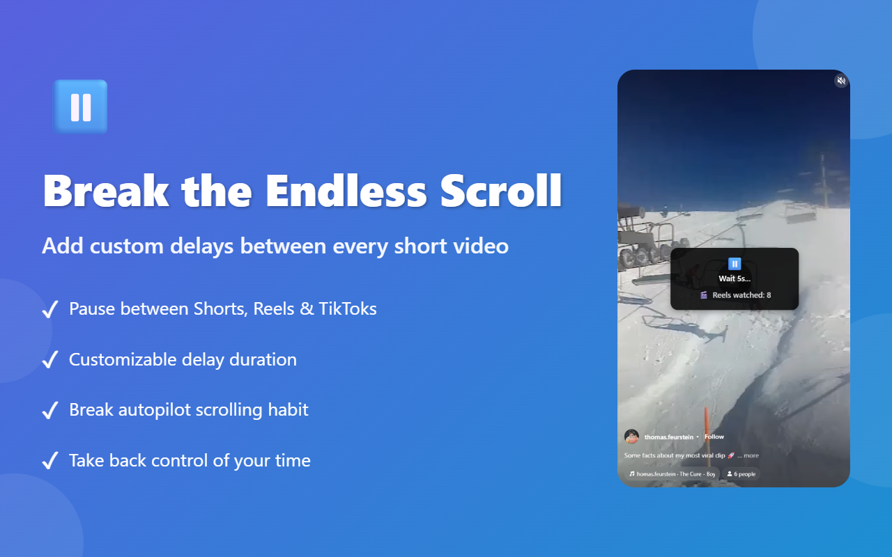
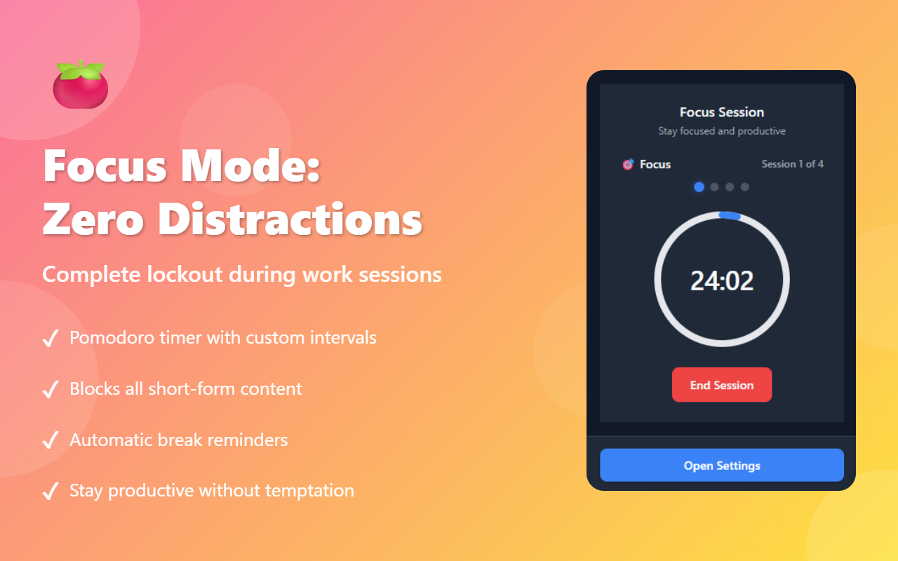
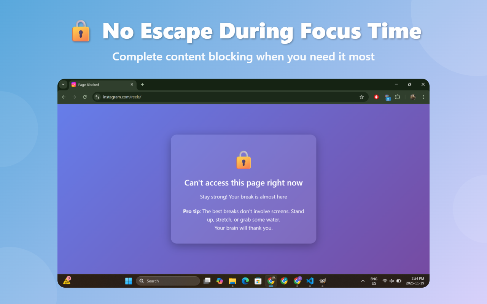

<!--  I might need at least one for that badge lol -->

# ScrollRot – Delay Short Videos on YouTube Shorts, TikTok, and Instagram Reels

**ScrollRot** is a productivity-focused Chrome extension that inserts a mandatory delay between short-form videos on **YouTube Shorts**, **TikTok**, and **Instagram Reels**. It helps reduce endless scrolling, cut screen time, and support digital detox habits.

If you struggle with doomscrolling or want a tool to slow down addictive short-video feeds, ScrollRot gives you back control.

## Screenshots (Chrome Web Store assets)

## Key Features

### ⏳ Delay Between Reels, Shorts, and TikTok

Insert an intentional pause between short videos to:

- Break the infinite-scroll habit
- Reduce binge-watching loops
- Give yourself a moment to stop or continue
- Bring awareness to short-video consumption

### 📊 Daily Short-Video Usage Tracking

See exactly how much short-form content you watch each day:

- Real-time counter for Shorts/TikTok/Reels
- Helpful for digital detox and screen-time reduction goals
- Fully offline, local-only stats (coming soon?)

### 🎯 Built-in Pomodoro Focus Mode

Block all short-form video feeds during focus sessions:

- Custom focus intervals (e.g., 25 or 50 minutes)
- Automatic breaks (TODO add sound?)
- Reduced temptation while studying or working

---

## Supported Platforms

ScrollRot currently supports:

- **YouTube Shorts**
- **TikTok**
- **Instagram Reels**

## Why ScrollRot Exists

Short-form platforms use autoplay, infinite scroll, and algorithmic loops designed to keep you hooked. ScrollRot adds friction so you can stay mindful instead of getting pulled into a passive binge.

Perfect for:

- Students staying focused while studying
- Professionals improving productivity at work
- Anyone reducing TikTok, Shorts, or Reels screen time
- Digital minimalists and digital detox enthusiasts
- Parents managing their own habits

## Privacy & Security

ScrollRot is built with privacy in mind:

- No data collection
- No analytics or remote servers
- All stats remain offline on your device
- No account or login needed
- Open source project

## Impact & Results

<!-- Users report: -->

The only user reports (me):

- **50–70% less time on Shorts/Reels/TikTok**
- Improved focus and deeper work sessions
- Better sleep by cutting late-night scrolling
- More free time for hobbies and relationships
- Increased awareness of daily digital habits
<!-- - I still don't have time for exams as I am writing a README instead. -->

## Installation

1. Install ScrollRot from the Chrome Web Store
2. Choose your delay duration
3. Browse Shorts, Reels, or TikTok like normal
4. Check the stats panel anytime (coming soon? eventually?)
5. Enable Pomodoro mode during focus sessions

## Support

Have feedback or feature ideas?  
Open an issue or contact: **vawolyx@gmail.com**

## Break the Doomscrolling Habit

Give yourself control back. Install ScrollRot and slow down Reels, Shorts, and TikTok today.
